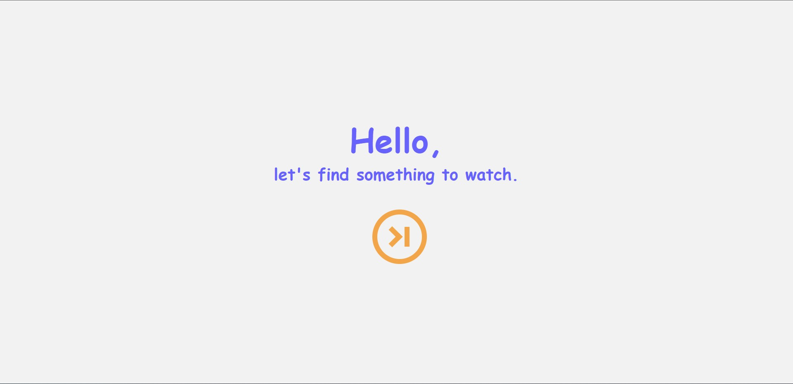
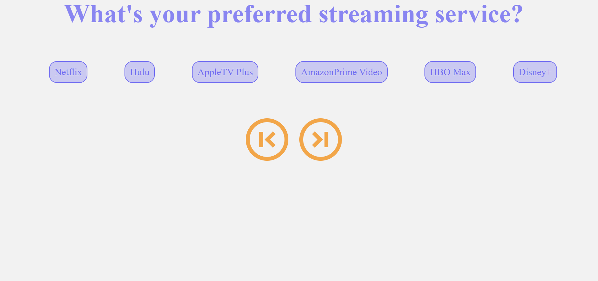

# What's Streamin'?
A simple web app that randomly generates a movie or show to watch based on user input criteria

Project Members:
Tony, Chase, Dennis, Darryl, Matt

Deployed Site [here](https://swagnarok630.github.io/Stream_Availability/)

Stack: HTML, CSS (Bootstrap, CSS.GG), JavaScript

API: Streaming Availability API

## Criteria
* The user can start the app with the press of a button
* The user will select a streaming platform to view from
* The user will select a genre they are interested in viewing
* The user will select if they'd like to view a movie or a series
* At any point before the results page, the user may go back to a previous selection to reselect if they so desire
* In any situation the user does not select an option, they will be prompted to do so before moving on
* After selecting from all three options, the user will be shown randomly generated results based on their selection

## Project Details:
HTML and CSS

* Load the page that displays a landing page with from the HTML
  * This will have a "Hello, let's find something to watch." This has a dark purple text and a light background color
* Create an interactive button and instructions on what platforms/genres to pick from
  * This will have an orange design and will be frozen and remain among each page we switch through
* Click the button so that it brings you to the next hidden page
  * This will have a forward and backward button that allows you to change pages
* Hide the pages with a hidden display in the CSS
  * This will be found in the CSS with the class called hidden and a transparent command
* Ask the user what streaming service they use, and store that value
  * This will have dark purple text and a light background with purple fill in
* Click the button so that it can bring you to the next page
  * This will be orange button with a forward and backward function
* See what genre the user wants to pick from and store that value
  * This will run inside the JS and will have purple text with dark purple bubbles
* Click the button so that it can bring you to the next page
  * This will be orange button with a forward and backward function
* Ask if the user would like to view a movie or show
  * This will have 2 choices with a dark purple bubble and purple text with a light background
* Click the button so that it can bring you to the next page
  * This will be orange button with a forward and backward function
* Generate an output from the stored values that allows the user to see what trailers they can watch 
  * This will have a Youtube page tied to a generate Youtube page with purple borders

JavaScript

* Download the web api and store the key so that the landing page is accessible and its interactive with the buttons
* Loop through a variety of different videos from each page that are stream services, genres, and types
* Run a function that stores a set of variables with the apiKey to use that as a call back later on 
* Use a fetching function that can fetch the keys from a series of True and False statements to see which statements a user clicks to produce stream services, genres and types
* Add into the function that randomizes them 
* Create a function that stores the data into a set variable that calls back later on
* Loop through the displayed data 
* Display the title, year, cast, over view, trailer and poster image
* Create an eventlistener that listens to see if someone doesn't pick a value from the stored values so that they cannot proceed further
* Create a function that checks to see if someone clicks in the streaming services
* Create a function that checks to see if someone clicks in the genres
* Create a function that checks to see if someone clicks in the type of input (movies and shows)
* Create an event listen and store functions for all 3 for a set of stored variables
* Lastly use a function that allows user to play and pause the video of the trailer

## Bonus Features

* A loading screen before the results page
  * 
* Modals used as prompts instead of alerts
  * 
